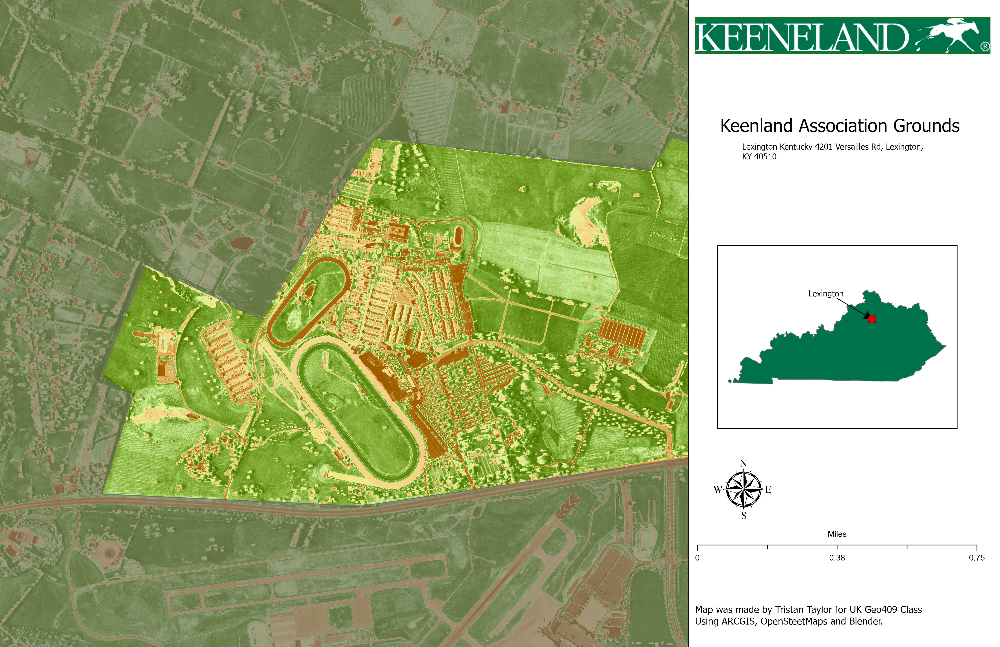

# Keeneland

## Keeneland Association: A Unique View of Lexington, KY
### Where This Area Is Located

This snapshot highlights the **Keeneland Association**, a historic thoroughbred racecourse located in **Lexington, Kentucky**. Known for its elegant grounds and deep ties to horse racing, this area is a cultural and economic landmark in central Kentucky.

  
*Map showing the Keeneland Association and surrounding area*

[View high-resolution version](PDF_Lab7.pdf)

---

**Created by:** Tristan  
**Tools Used:** OpenStreetMap, ArcGIS Pro, Blender  
**Data Sources:** OpenStreetMap, Custom ArcGIS layers  
**Purpose:** To visualize and communicate the unique layout and importance of this iconic area through geospatial and 3D design tools.
